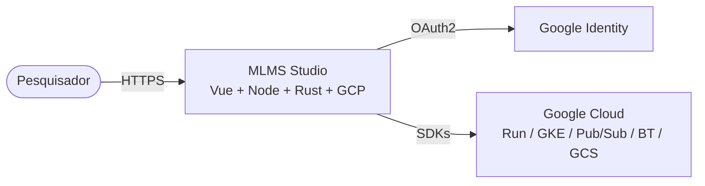
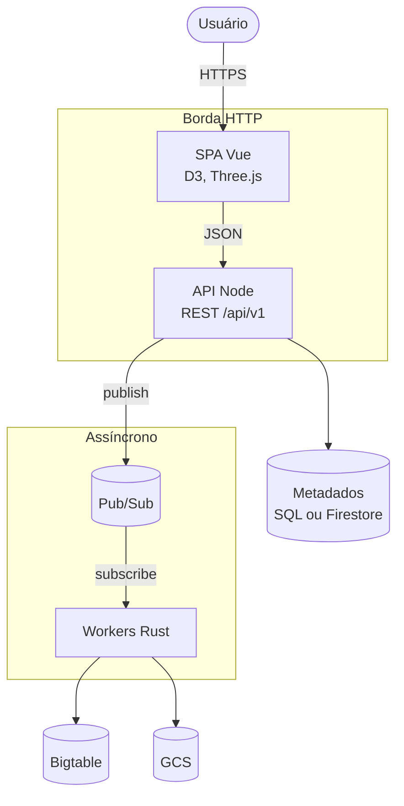
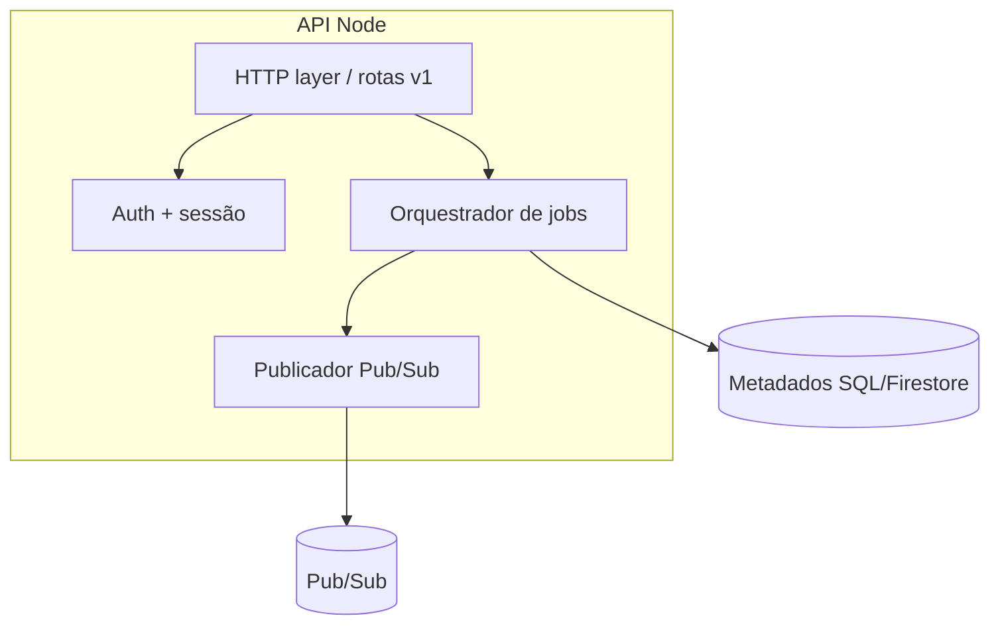

# C4 — MLMS Studio (rascunho alvo)

Visão alinhada ao [SOF-1](http://127.0.0.1:3100/issues/2cb9ddc2-c409-46e2-99e4-3b9a56b16e30) e aos ADRs em [`docs/adr/`](../adr/README.md).

## Nível 1 — Contexto

Estilo C4 (diagrama equivalente em Mermaid genérico para renderização ampla).

## Nível 2 — Contêineres

## Nível 3 — Componentes (API Node — exemplo)

OpenAPI v0 do BFF: [`docs/api/openapi-v0.yaml`](../api/openapi-v0.yaml) ([SOF-4](http://127.0.0.1:3100/issues/3aa7acfa-0c5c-4193-baa8-561d595f4ac9)).

## Revisão pós-taxonomia de jobs ([SOF-28](http://127.0.0.1:3100/issues/4a8810ca-0783-4f53-a654-2dd5e284f2f1))

**Condicionante (CTO):** depois da taxonomia MATLAB → `job_type` / payloads (entrega do Data Lead em [SOF-28](http://127.0.0.1:3100/issues/4a8810ca-0783-4f53-a654-2dd5e284f2f1)), reavaliar se estes diagramas precisam de **nível extra** para domínios de análise (GA, picos/biomarcadores, redes `nn_*`, etc.) ou se **notas no plano de dados** + OpenAPI continuam suficientes.

**Critérios (julgamento, não regra rígida):**

| Sinal | Tendência |
|-------|-----------|
| Famílias de job com **deploy, fila, SLA ou stores** claramente distintos | Vale **subdividir** o bloco *Workers Rust* (nível 2 ou 3) ou um diagrama auxiliar de *bounded contexts* de pipeline. |
| **Mesmo** worker/binário; só mudam payload e esquema BT/GCS | Manter um agregado *Workers Rust*; detalhar na tabela da SOF-28 e no plano de dados ([SOF-8](http://127.0.0.1:3100/issues/56119fa8-88c4-429e-b51e-9c4db8f3db08)). |
| **Fronteira de rede/IAM** entre famílias | Reforçar no nível contexto ou contêiner (caixas separadas + legendas). |

**Estado:** SOF-28 ainda `in_progress`; esta secção deve ser atualizada numa passagem curta quando a taxonomia estiver fechada (comitê: Architecture Lead + Data Lead; **Distributed Systems Engineer** valida implicações em filas e timeouts).

**Handoff:** **API Engineer** / Backend ([SOF-4](http://127.0.0.1:3100/issues/3aa7acfa-0c5c-4193-baa8-561d595f4ac9)) mantém `job_type` e schemas alinhados à tabela da SOF-28.
