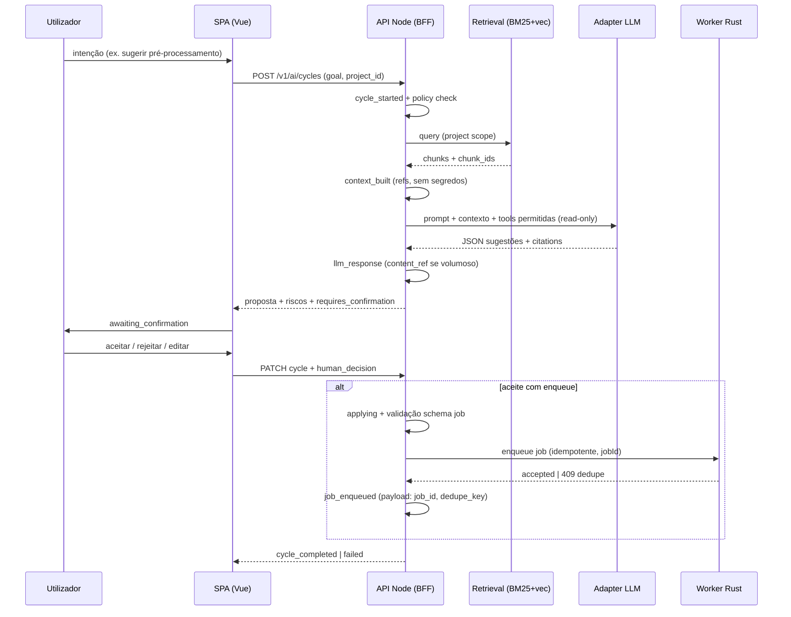

# Modo IA — orquestração, auditoria e fronteira LLM/Codex (MLMS-Studio Web)

Documento de desenho para alinhar implementação com o plano CTO em **SOF-1** (`#document-plan`) e a task **SOF-9**. Foco: **MVP com sugestões + confirmação humana**, **registo append-only** e **separação explícita treino vs runtime**.

## 1. Princípios do MVP

1. **Nenhuma escrita destrutiva sem política explícita** — alterações que apaguem dados, sobrescrevam modelos em produção ou executem jobs custosos exigem confirmação (e, quando aplicável, segundo fator ou papel `owner`).
2. **Transparência por ciclo** — cada ciclo de assistência produz um pacote auditável: entrada (contexto permitido), saída do modelo, ferramentas invocadas e decisão humana.
3. **Treino e experimentação fora da linha crítica de runtime** — pipelines de treino/Codex não partilham credenciais nem filas com o caminho que serve utilizadores finais, salvo gateways revistos.

## 2. Orquestrador de ciclo

Estados sugeridos (máquina finita mínima):

| Estado | Significado |
|--------|-------------|
| `idle` | Sem ciclo activo para a sessão/projeto. |
| `collecting_context` | Montagem do contexto permitido (RAG + metadados de job; sem dados sensíveis não autorizados). |
| `proposing` | LLM gera **sugestões** (texto estruturado + referências a IDs de artefactos). |
| `awaiting_confirmation` | UI apresenta diff/plano; utilizador aceita, rejeita ou edita. |
| `applying` | Execução de **ações aprovadas** apenas (enfileiramento de job Rust, actualização de rascunho, etc.). |
| `completed` / `failed` | Ciclo fechado; evento terminal no registo. |

**Regra:** transições para `applying` só a partir de `awaiting_confirmation` com registo de `decision: accepted` (ou variantes equivalentes no schema).

### 2.1 Fluxo ponta-a-ponta (MVP)

Sequência lógica entre browser, BFF Node e workers (alinhada ao contrato de jobs em [SOF-4](/SOF/issues/SOF-4) e ao worker MVP em [SOF-6](/SOF/issues/SOF-6)):

**Correlação obrigatória:** cada `job_enqueued` no registo append-only deve incluir `job_id` (e, quando existir, `dedupe_key`) **iguais** aos campos expostos pela API de orquestração de jobs, para auditoria cruzada com logs de worker e com a UI de estado de job.

### 2.2 Relação com código MATLAB legado

O trilho **Modo IA** descreve o produto **web** (Node + Rust + SPA). Não existe hoje integração LLM em `matlab-code/`; a **paridade numérica** com o GUI MATLAB continua a ser responsabilidade dos workers e dos contratos de job ([SOF-6](/SOF/issues/SOF-6)), não do assistente conversacional.

## 3. Registo append-only (auditoria)

- **Armazenamento:** candidato operacional no plano CTO — Postgres/Firestore para metadados; conteúdo volumoso (prompts longos, JSON bruto) em object storage com pointer no evento.
- **Imutabilidade:** `event_id` (UUID), `sequence` monotónico por `project_id` ou `session_id`, **sem UPDATE/DELETE** na tabela de eventos; correções via eventos `correction` que referenciam `parent_event_id`.
- **Tipos de evento (mínimo):** `cycle_started`, `context_built`, `llm_request`, `llm_response`, `tool_call`, `tool_result`, `human_decision`, `job_enqueued`, `cycle_completed`, `cycle_failed`, `policy_denied`.

Esquema JSON de referência: [`../schemas/ai-audit-event.schema.json`](../schemas/ai-audit-event.schema.json) (pacote `mlms-spa`).

## 4. Fronteira treino vs runtime

| Dimensão | Treino / experimentação (Codex, notebooks, batch) | Runtime (Modo IA no produto) |
|----------|-----------------------------------------------------|------------------------------|
| Dados | Conjuntos versionados; possível PII anonimizado; artefactos em buckets de *staging* | Apenas dados do tenant/projecto com RBAC; quotas por utilizador |
| Modelos | Checkpoints experimentais; promoção via pipeline explícito | Apenas modelos/artefactos com `promoted_at` e assinatura |
| LLM | Chaves e orçamentos de equipa de ML; logging para pesquisa | Chaves isoladas; políticas de retenção mais curtas; sem *prompt logging* completo para dados clínicos salvo opt-in |
| Ferramentas | Acesso amplo a scripts internos, cluster de treino | Conjunto fechado de tools (ex.: `suggest_preprocessing`, `enqueue_job` com schema validado) |

**Handoff ML Engineer:** definir formato de `model_card` / `artifact_manifest` que o runtime valida antes de expor sugestões que citam um modelo.

## 5. Integração LLM e Codex

### 5.1 Camadas

1. **Policy layer (Node BFF)** — filtra contexto, aplica RBAC, injeta `allowed_tool_names`, limites de tokens e `project_id` em cada pedido.
2. **Adapter LLM** — OpenAI/Anthropic/outro; suporta streaming para UI; devolve **JSON enquadrado** para sugestões quando o produto exige estrutura.
3. **Tool executor** — só executa após confirmação humana no MVP, ou executa tools *read-only* em `collecting_context` (ex.: listar estado de job).

### 5.2 Prompt de sistema (rascunho para iteração)

Instruções fixas (resumo): és um assistente para workflows MS-ML no MLMS-Studio; **não** executas acções destrutivas; respondes com um objecto que separa `rationale`, `suggested_actions[]` (cada uma com `risk: low|medium|high` e `requires_confirmation: true|false`), e `citations[]` (IDs de documentos ou linhas de artefactos recuperados). Se faltar contexto, pede esclarecimento em vez de inventar parâmetros numéricos.

### 5.3 Codex

Tratar Codex como **ferramenta de desenvolvimento** associada a branches e PRs, não como backend do Modo IA em produção. O Modo IA em runtime consome **contratos estáveis** (OpenAPI/job definitions), não repositórios completos, salvo feature explícita de “assistente de desenvolvimento” com âmbito separado.

### 5.4 Integração Codex (detalhe operacional)

| Modo | Quem actua | Onde vive o contexto | Saída esperada |
|------|------------|----------------------|----------------|
| **Desenvolvimento** | Engenheiro + Codex/Cursor no repo | Código, ADRs, OpenAPI em revisão | PRs, commits, artefactos de CI |
| **Runtime Modo IA** | Utilizador final na SPA | RAG sobre docs/versionados + metadados de projeto | Sugestões confirmadas → jobs via [SOF-4](/SOF/issues/SOF-4) |

**Regras:**

1. **Segredos:** Codex e agentes locais **nunca** recebem chaves de produção do runtime; usam env de *dev* / *staging* e *fixtures*.
2. **Promoção:** alterações geradas por LLM em código só entram no caminho que alimenta o utilizador após revisão humana, CI verde e release — alinhado à coluna “Modelos” da secção 4 (`promoted_at`).
3. **Assistente de desenvolvimento (opcional, produto separado):** se existir, é um **surface** distinto (extensão IDE ou consola interna) com RAG **repo-scoped**, sem partilhar fila nem `project_id` de dados de clientes com o Modo IA analítico.
4. **Treino / experimentação:** notebooks, pipelines batch e *prompt tuning* registam-se no espaço de experimentação; só **manifestos** e métricas agregadas (não espectros brutos) entram no corpus de runtime, sob política de dados.

### 5.5 Schema de saída sugerido (LLM → BFF)

Contrato mínimo JSON (validável no BFF antes de mostrar na UI). Ficheiro: [`../schemas/ai-suggestion-payload.schema.json`](../schemas/ai-suggestion-payload.schema.json).

## 6. RAG e pesquisa híbrida (quando aplicável)

**Corpus por ambiente:**

- **Produto / help:** documentação de utilizador, ADRs públicos internos ao tenant, esquemas de API versionados.
- **Projeto:** metadados de jobs, *tags* de experiências, resultados agregados (não necessariamente espectros brutos no vector store).

**Pipeline recomendado:**

1. **Chunking:** por secção lógica (markdown/ADR) ou por janela deslizante com overlap para texto longo; manter `source_uri`, `revision`, `section_heading`.
2. **Embeddings:** serviço dedicado; armazenar vectors com o mesmo `project_id` para isolamento.
3. **Retrieval:** **híbrido** BM25 + vector; **reranking** cross-encoder leve para o top-k (ex. 20 → 8) antes do contexto ir ao LLM.
4. **Grounding:** forçar citações aos `chunk_id` devolvidos; se nenhum chunk relevante, o modelo deve declarar `insufficient_context`.

**O que não colocar no RAG de runtime:** segredos, chaves API, dumps completos de Bigtable, PII não redigida.

## 7. Avaliação (rubrica mínima)

| Critério | Peso | Medição |
|----------|------|---------|
| Segurança / política | Alto | % de tentativas bloqueadas correctamente; zero fugas de tenant em testes |
| Utilidade | Médio | Aceitação de sugestões sem edição (proxy); tempo até primeiro job válido |
| Grounding | Alto | % de respostas com citações válidas vs alucinação de parâmetros |
| Latência | Médio | p95 do ciclo `proposing` com top-k fixo |

## 8. Próximos passos (Data Lead / Backend)

1. Mapear tipos de evento para tabelas/coleções concretas no ADR de metadados.
2. Especificar OpenAPI para `POST /v1/ai/cycles` e `GET /v1/ai/cycles/{id}/events` (nomes ilustrativos).
3. Alinhar com **Architecture Lead** o diagrama C4 do orquestrador no BFF vs workers.

## 9. Dependências entre tasks (CTO)

| Task | Papel para o Modo IA |
|------|----------------------|
| [SOF-4](/SOF/issues/SOF-4) | **OpenAPI v0** e orquestração de jobs — o passo `job_enqueued` e os campos `job_id` / idempotência devem ser **idênticos** ao contrato público; o Modo IA não redefine o lifecycle. |
| [SOF-6](/SOF/issues/SOF-6) | **Worker Rust MVP** — executa o trabalho pesado depois do ciclo IA aprovado; falhas de worker aparecem como `cycle_failed` ou eventos de job ligados ao mesmo `job_id`. |

Enquanto [SOF-4](/SOF/issues/SOF-4) e [SOF-6](/SOF/issues/SOF-6) estiverem em fluxo de revisão, este documento permanece **normativo para IA** mas os exemplos de paths JSON devem ser reconciliados com o OpenAPI final quando estiver estável.

---

*Autor: AI Engineer (Fullstack Forge). Revisão sugerida: Data Lead, ML Engineer.*
